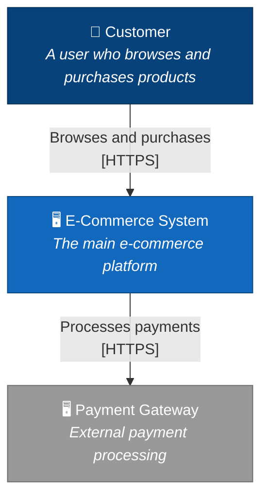
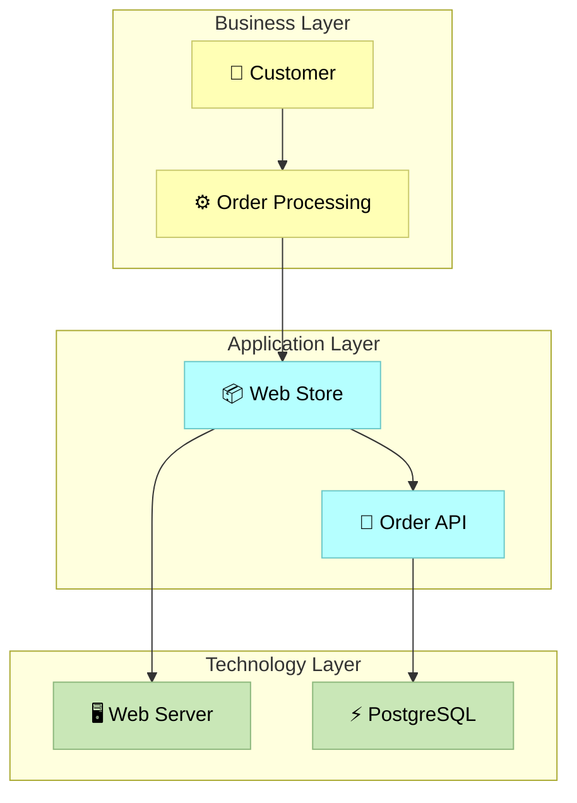

# ArchiMate & C4 Architecture Plugin

A Claude Code plugin for architectural documentation and visualization using **C4 Model** and **ArchiMate** standards. Generate diagrams from existing codebases (post-hoc documentation) or design new systems during the planning phase.

## Features

- **C4 Model Diagrams**: Generate Context, Container, Component, and Code level diagrams
- **ArchiMate Diagrams**: Create enterprise architecture views across Business, Application, and Technology layers
- **Persistent Artifact Registry**: Unique URN-based identifiers for all architectural elements, enabling reuse across diagrams
- **Codebase Analysis**: Automatically analyze codebases to extract architectural information
- **Architecture Planning**: Create ADRs, design documents, and migration plans
- **Mermaid Output**: All diagrams rendered in Mermaid format for easy viewing

## Installation

```bash
# Install from Claude Code marketplace
claude plugins install archimate-c4

# Or install locally for development
cd archimate-c4-plugin
npm install
npm run build
claude plugins link .
```

## Skills (Slash Commands)

### `/c4` - Generate C4 Model Diagrams

```bash
# Generate system context diagram (Level 1)
/c4 context

# Generate container diagram (Level 2)
/c4 container

# Generate component diagram (Level 3)
/c4 component

# Generate all levels
/c4 all

# With options
/c4 container --direction LR --analyze
```

**Options:**
- `--scope <id>` - Focus on specific element
- `--format <fmt>` - Output format (mermaid, plantuml)
- `--direction <dir>` - Diagram direction (TB, LR, BT, RL)
- `--analyze` - Analyze current codebase first

### `/archimate` - Generate ArchiMate Diagrams

```bash
# Generate layered view (all layers)
/archimate layered

# Generate specific layer views
/archimate business
/archimate application
/archimate technology

# With options
/archimate application --direction LR
```

**Options:**
- `--layers <l1,l2>` - Include specific layers
- `--format <fmt>` - Output format
- `--direction <dir>` - Diagram direction

### `/arch-analyze` - Analyze Codebase Architecture

```bash
# Full analysis with C4 and ArchiMate output
/arch-analyze

# C4 only output
/arch-analyze --output c4

# Deep analysis including tests
/arch-analyze --depth deep --include-tests
```

**Options:**
- `--output <format>` - c4, archimate, or both
- `--depth <level>` - shallow, normal, deep
- `--include-tests` - Include test files
- `--save <path>` - Save to file

### `/arch-plan` - Architecture Planning Documents

```bash
# Create an Architectural Decision Record
/arch-plan adr --title "Choose Database Technology"

# Create a design document
/arch-plan design --title "New Authentication System"

# Create a migration plan
/arch-plan migration --title "Monolith to Microservices"
```

**Options:**
- `--title <title>` - Document title
- `--context <ctx>` - Context description
- `--output <fmt>` - Diagram format

### `/arch-registry` - Manage Artifact Registry

```bash
# List all registered artifacts
/arch-registry list

# Filter by category
/arch-registry list --category container

# Show artifact details
/arch-registry show api-server

# Export registry to markdown
/arch-registry export

# Show statistics
/arch-registry stats

# Sync artifacts with codebase
/arch-registry sync
```

**Options:**
- `--category <cat>` - Filter by category (system, container, component, code)
- `--tag <tag>` - Filter by tag
- `--format <fmt>` - Output format (table, json, markdown)

## Artifact Registry

The plugin maintains a persistent registry of architectural artifacts at `.architecture/artifacts.json`. Each artifact has a **unique URN** (Uniform Resource Name) that identifies it across all diagrams and analyses.

### URN Format

```
urn:archimate-c4:{org}:{repo}:{category}:{qualifier?/}{name}
```

**Examples:**
- `urn:archimate-c4:acme:ecommerce:system:ecommerce-platform`
- `urn:archimate-c4:acme:ecommerce:container:api-server`
- `urn:archimate-c4:acme:ecommerce:component:api-server/order-controller`
- `urn:archimate-c4:acme:ecommerce:code:api-server/order-controller/OrderService`

### Categories

| Category | Description | C4 Level |
|----------|-------------|----------|
| `person` | Users/actors who interact with systems | Context |
| `system` | Top-level software systems | Context |
| `external` | External systems/services | Context |
| `container` | Deployable units | Container |
| `component` | Major modules within containers | Component |
| `code` | Classes, interfaces, functions | Code |
| `archimate` | ArchiMate elements (any layer) | N/A |

### Artifact Reuse

When an artifact is created (e.g., by analyzing a container named `api-server`), it gets a persistent URN. If the same container is referenced later:

1. The existing artifact is found by URN
2. Properties are updated (version incremented)
3. The same unique identity is maintained

This ensures:
- **Consistency**: Same element = same URN across all diagrams
- **Traceability**: Link from code to architecture and back
- **Evolution**: Track changes over time with versioning

## Agents

### Architecture Documenter

Autonomous agent that explores a codebase and generates comprehensive documentation.

```bash
# Launch the documenter agent
claude task architecture-documenter "Document the architecture of this project"
```

The agent will:
1. Explore project structure
2. Analyze dependencies
3. Identify components and containers
4. Generate C4 and ArchiMate diagrams
5. Produce markdown documentation

## Example Outputs

### C4 Context Diagram



### ArchiMate Layered View



## C4 Model Overview

The C4 model provides four levels of abstraction:

| Level | Name | Description |
|-------|------|-------------|
| 1 | Context | System scope, users, and external systems |
| 2 | Container | High-level technology choices (web apps, APIs, databases) |
| 3 | Component | Major structural building blocks within a container |
| 4 | Code | Implementation details (classes, interfaces) |

## ArchiMate Overview

ArchiMate provides enterprise architecture modeling across layers:

| Layer | Elements | Purpose |
|-------|----------|---------|
| Business | Actors, Processes, Services | Business capabilities |
| Application | Components, Interfaces, Data | Software systems |
| Technology | Nodes, Devices, Artifacts | Infrastructure |

## Development

```bash
# Install dependencies
npm install

# Build
npm run build

# Watch mode
npm run dev

# Run tests
npm test

# Lint
npm run lint
```

## Project Structure

```
archimate-c4-plugin/
├── src/
│   ├── types/              # Type definitions
│   │   ├── c4.ts           # C4 model types
│   │   ├── archimate.ts    # ArchiMate types
│   │   ├── artifacts.ts    # Artifact registry types
│   │   ├── c4-artifacts.ts # C4 with artifact references
│   │   ├── archimate-artifacts.ts # ArchiMate with artifacts
│   │   └── index.ts        # Common types
│   ├── generators/         # Diagram generators
│   │   ├── c4-mermaid.ts
│   │   └── archimate-mermaid.ts
│   ├── analyzers/          # Code analyzers
│   │   └── codebase-analyzer.ts
│   ├── utils/              # Utility modules
│   │   ├── artifact-registry.ts    # Registry management
│   │   ├── artifact-persistence.ts # Save/load registry
│   │   ├── artifact-templates.ts   # Artifact templates
│   │   └── artifact-linker.ts      # Link code to artifacts
│   ├── skills/             # Slash command implementations
│   │   ├── c4-skill.ts
│   │   ├── archimate-skill.ts
│   │   ├── analyze-skill.ts
│   │   ├── plan-skill.ts
│   │   └── registry-skill.ts
│   ├── agents/             # Autonomous agents
│   │   └── documenter-agent.ts
│   └── index.ts            # Main exports
├── templates/              # Document templates
├── examples/               # Example outputs
├── docs/                   # Additional documentation
├── .architecture/          # Generated (per-project)
│   └── artifacts.json      # Artifact registry
├── claude-plugin.json      # Plugin manifest
├── package.json
├── tsconfig.json
└── README.md
```

## Contributing

Contributions welcome! Please read the contributing guidelines and submit PRs.

## License

MIT License

## Resources

- [C4 Model](https://c4model.com/) - The C4 model for visualising software architecture
- [ArchiMate](https://www.opengroup.org/archimate-forum/archimate-overview) - The Open Group ArchiMate standard
- [Mermaid](https://mermaid.js.org/) - Diagram and chart generation
- [Claude Code](https://claude.ai/claude-code) - AI-powered coding assistant
