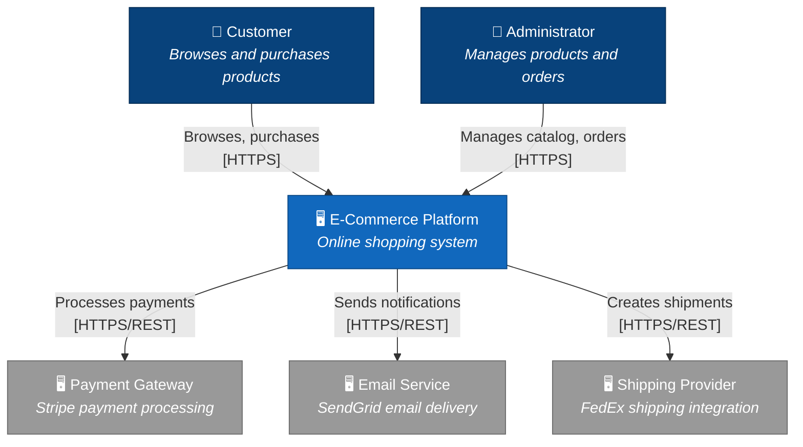
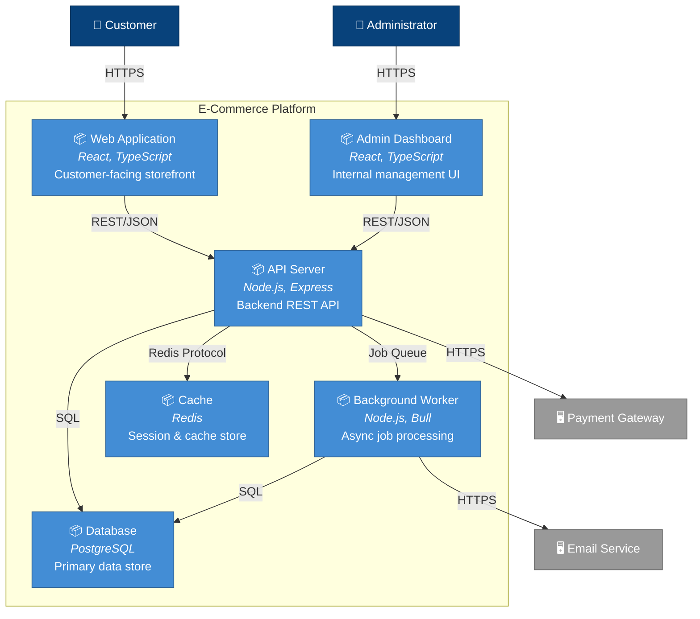
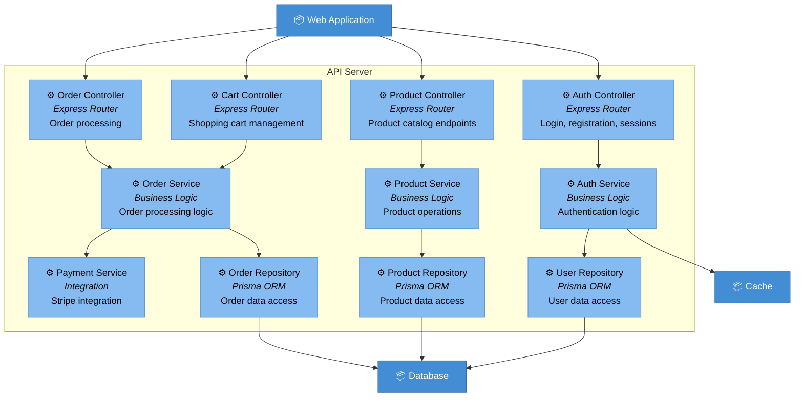
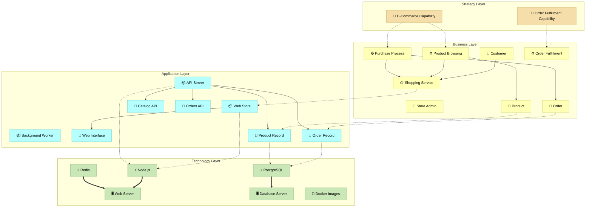

# Architecture Documentation: E-Commerce Platform

> Generated by Architecture Documenter Agent

## Executive Summary

The E-Commerce Platform is a modern web-based shopping system that enables customers to browse products, manage shopping carts, and complete purchases. Built on a Node.js/TypeScript stack with a React frontend, the system integrates with external payment processing and email notification services.

The architecture follows a layered approach with clear separation between the customer-facing web application, backend API services, and data storage. The system supports horizontal scaling through containerization and can handle significant traffic loads.

## Technology Stack

| Category | Technology | Purpose |
|----------|------------|---------|
| Language | TypeScript | Primary development language |
| Frontend | React | Customer-facing web interface |
| Backend | Node.js + Express | API server |
| Database | PostgreSQL | Primary data store |
| Cache | Redis | Session management, caching |
| Queue | Bull | Background job processing |
| Containerization | Docker | Deployment packaging |

## System Context (C4 Level 1)

This diagram shows the E-Commerce system in context with its users and external dependencies.



## Container View (C4 Level 2)

This diagram shows the main deployable units within the E-Commerce Platform.



## Component View: API Server (C4 Level 3)



## ArchiMate Layered View



## Key Architectural Patterns

1. **Layered Architecture**: Clear separation between presentation, business logic, and data access layers in the API server.

2. **Repository Pattern**: Data access is abstracted through repository classes, enabling easier testing and potential database changes.

3. **Service Layer**: Business logic is encapsulated in service classes, keeping controllers thin and focused on HTTP concerns.

4. **Background Job Processing**: Long-running tasks (email sending, report generation) are handled asynchronously via Bull queues.

5. **Caching Strategy**: Redis is used for session management and caching frequently accessed data like product catalogs.

## External Integrations

| Integration | Type | Purpose | Implementation |
|-------------|------|---------|----------------|
| Stripe | Payment API | Process credit card payments | `src/services/payment.service.ts` |
| SendGrid | Email API | Transactional emails | `src/services/email.service.ts` |
| FedEx | Shipping API | Create shipping labels | `src/services/shipping.service.ts` |

## Directory Structure

```
ecommerce-platform/
├── src/
│   ├── controllers/      # HTTP request handlers
│   │   ├── auth.controller.ts
│   │   ├── product.controller.ts
│   │   ├── cart.controller.ts
│   │   └── order.controller.ts
│   ├── services/         # Business logic
│   │   ├── auth.service.ts
│   │   ├── product.service.ts
│   │   ├── order.service.ts
│   │   ├── payment.service.ts
│   │   └── email.service.ts
│   ├── repositories/     # Data access layer
│   │   ├── user.repository.ts
│   │   ├── product.repository.ts
│   │   └── order.repository.ts
│   ├── models/           # Database models (Prisma)
│   ├── middleware/       # Express middleware
│   ├── jobs/             # Background job handlers
│   ├── utils/            # Utility functions
│   └── app.ts            # Application entry point
├── web/                  # React frontend
├── admin/                # Admin dashboard
├── prisma/               # Database schema & migrations
├── docker/               # Docker configurations
└── tests/                # Test suites
```

## Recommendations

1. **API Gateway**: Consider adding an API gateway (Kong, AWS API Gateway) for rate limiting, authentication, and request routing.

2. **Event-Driven Architecture**: For better decoupling, consider implementing domain events for cross-service communication.

3. **Monitoring**: Implement distributed tracing (Jaeger, Zipkin) for better observability across services.

4. **Database Read Replicas**: For scaling read operations, consider adding PostgreSQL read replicas.

---

*Generated by ArchiMate & C4 Architecture Plugin*
