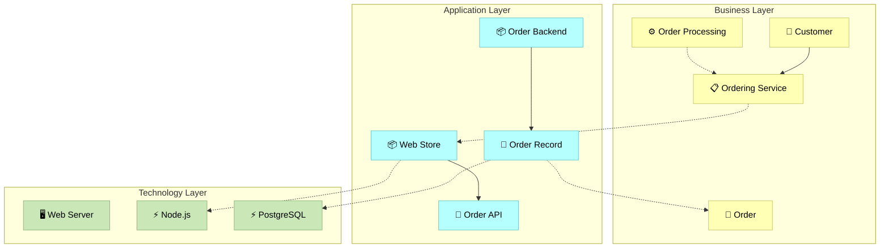

# ArchiMate Layered View Template

## Instructions

Fill in the elements for each architectural layer.

## Business Layer

### Business Actors
| ID | Name | Description |
|----|------|-------------|
| ba_customer | Customer | External customer |
| ba_employee | Employee | Internal staff |

### Business Processes
| ID | Name | Description |
|----|------|-------------|
| bp_order | Order Processing | Handle customer orders |
| bp_fulfillment | Order Fulfillment | Ship products to customers |

### Business Services
| ID | Name | Description |
|----|------|-------------|
| bs_ordering | Ordering Service | Allow customers to place orders |

### Business Objects
| ID | Name | Description |
|----|------|-------------|
| bo_order | Order | Order information |
| bo_product | Product | Product catalog item |

## Application Layer

### Application Components
| ID | Name | Description |
|----|------|-------------|
| ac_webstore | Web Store | Customer-facing web application |
| ac_backend | Order Backend | Backend processing system |
| ac_inventory | Inventory System | Stock management |

### Application Services
| ID | Name | Description |
|----|------|-------------|
| as_order_api | Order API | REST API for orders |
| as_product_api | Product API | Product catalog API |

### Application Interfaces
| ID | Name | Description |
|----|------|-------------|
| ai_web_ui | Web Interface | Browser-based UI |
| ai_rest | REST API | HTTP/JSON interface |

### Data Objects
| ID | Name | Description |
|----|------|-------------|
| do_order | Order Record | Persisted order data |
| do_product | Product Record | Product catalog data |

## Technology Layer

### Nodes
| ID | Name | Description |
|----|------|-------------|
| tn_webserver | Web Server | Application hosting |
| tn_dbserver | Database Server | Data storage |

### System Software
| ID | Name | Description |
|----|------|-------------|
| ts_nodejs | Node.js | JavaScript runtime |
| ts_postgres | PostgreSQL | Relational database |

### Artifacts
| ID | Name | Description |
|----|------|-------------|
| ta_docker | Docker Image | Container deployment |

## Relationships

| From | To | Type | Description |
|------|-----|------|-------------|
| ba_customer | bs_ordering | serving | uses |
| bp_order | bs_ordering | realization | implements |
| ac_webstore | as_order_api | serving | exposes |
| ac_backend | do_order | access | read/write |
| ac_webstore | ts_nodejs | realization | runs on |

## Generated Diagram

## Notes

- Group elements by layer for clarity
- Show cross-layer relationships to demonstrate realization
- Use appropriate ArchiMate relationship types
- Keep each layer focused on its concerns
