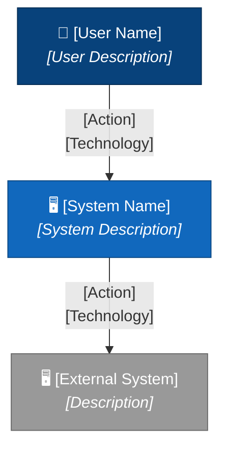

# C4 System Context Diagram Template

## Instructions

Fill in the placeholders below to generate a System Context diagram.

## System Information

- **System Name**: [Your System Name]
- **System Description**: [Brief description of what your system does]

## Users/Actors

List all people/actors who interact with your system:

| ID | Name | Description | External? |
|----|------|-------------|-----------|
| user_1 | [Name] | [Description] | No |
| admin | [Name] | [Description] | No |
| partner | [Name] | [Description] | Yes |

## External Systems

List all external systems your system interacts with:

| ID | Name | Description |
|----|------|-------------|
| ext_system_1 | [System Name] | [Description] |
| payment | Payment Gateway | Processes payments |
| email | Email Service | Sends notifications |

## Relationships

Describe how actors and systems interact:

| From | To | Description | Technology |
|------|-----|-------------|------------|
| user_1 | [your_system] | [What do they do?] | HTTPS |
| [your_system] | ext_system_1 | [Purpose of integration] | REST API |

## Generated Diagram

## Notes

- Keep the diagram focused: 5-20 elements maximum
- All external systems should be clearly marked
- Include the technology/protocol for each relationship
- Descriptions should be concise but informative
